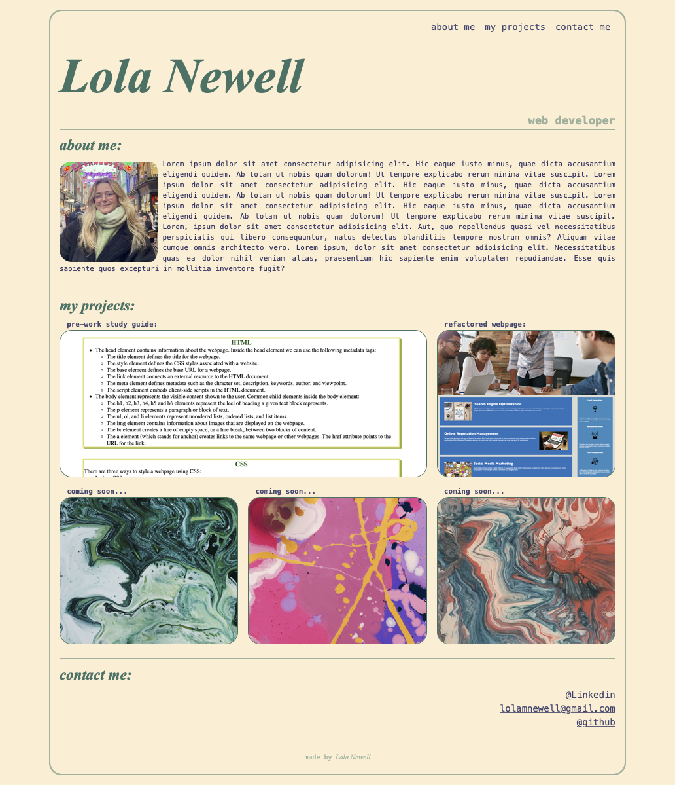
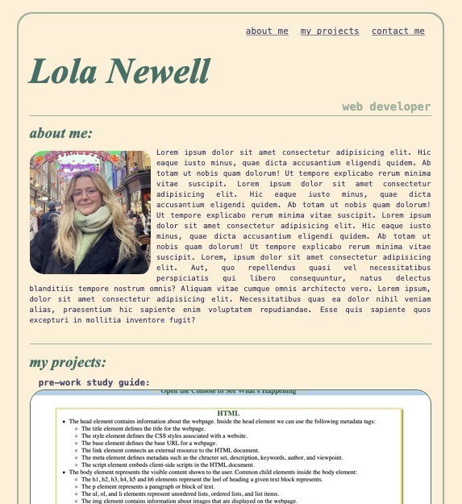

# my-portfolio!

## Description

This page is a portfolio of all my web development projects. It has a nav bar, header, 'about me' section, a 'my projects' section and a contact section.

I've utilised the CSS I've learnt over the first two weeks of my course such as flexbox, grid and media query to make the website not only look nice but to be adaptive to changing window and screen sizes.

## Installation
The website can be accessed [here](https://lolanewell.github.io/my-portfolio/#my-projects)

## Usage
desktop: 

tablet: 

mobile: 

## Credits

N/A

## License

N/A
